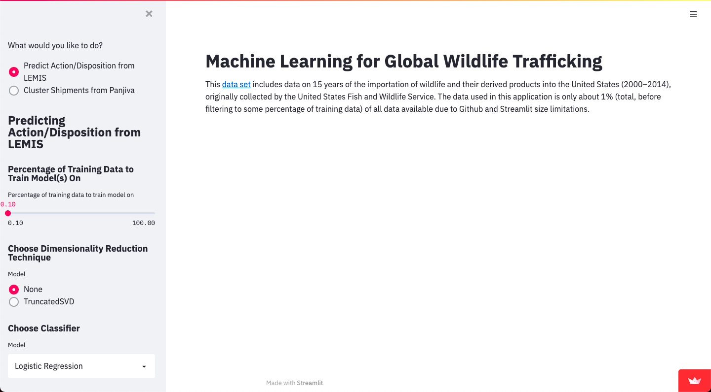

# Machine Learning for Global Wildlife Trafficking

This application is an extensive modeling approach for Wildlife Trafficking (live animals and wildlife products) importing via shipments into the US. You can access the application here: 
[Machine Learning for Global Wildlife Trafficking](https://share.streamlit.io/AniMadurkar/Machine-Learning-for-Global-Wildlife-Trafficking/main/streamlit_app.py)

This product leverages 2 datasets: LEMIS and Panjiva. The [LEMIS data set](https://data.nal.usda.gov/dataset/data-united-states-wildlife-and-wildlife-product-imports-2000%E2%80%932014) includes data on 15 years of the importation of wildlife and their derived products into the United States (2000–2014), originally collected by the United States Fish and Wildlife Service. The [Panjiva data set](https://panjiva.com/) was manually downloaded through a paid Panjiva account and it includes data for imported shipments (2007-2021) related to wildlife for HS codes 01, 02, 03, 04, and 05 as these represent animals & animal products.

The data used in this application is only about 1% (total, before filtering to some percentage of training data) of all data available due to Github and Streamlit size limitations.

## Getting Started

These instructions will get you a copy of the project up and running on your local machine.

### Clone the Repository

Get a copy of this project by simply running the git clone command.

``` git
git clone https://github.com/AniMadurkar/Machine-Learning-for-Global-Wildlife-Trafficking.git
```

### Prerequisites

Before running the project, we have to install all the dependencies from requirements.txt

``` pip
pip install -r requirements.txt
```

### Hosting

Last, get the project hosted on your local machine with a single command.

``` cmd
streamlit run streamlit_app.py
```

<p align=center>
    
</p>


### Predicting Action/Disposition from LEMIS Demo

https://user-images.githubusercontent.com/49261829/129825120-34f4478e-5ef2-4c94-a223-a7f4e140da8b.mov


### Clustering Shipments from Panjiva Demo

https://user-images.githubusercontent.com/49261829/129825356-75dc75a8-4c5d-47e4-9aff-9febb4ee8f54.mov


### Running the ETL Scripts

If you go to downloading the full LEMIS dataset or happen to have a Panjiva subscription and download a bunch of files, you can use our ETL scripts to help clean each of them as well. All you want to do is set up your folder structure so that in the folder with the scripts, you have two additional folders:
1. Lemis Data
2. Panjiva Data

Drop your files in each of these respectively and then you can run the scripts as such:

``` python
python lemis.py
python panjiva.py
```

These have code at the bottom to output a sample of each cleaned file. If you comment out the lines where you're getting the sample, you can output the full cleaned dataframe to csv.
